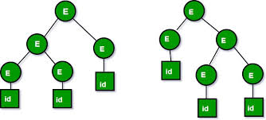

  
# PROGRAMAÇÃO I

# SINTAXE E SEMÂNTICA

#
Ao estudar uma linguagem de programação é fundamental uma perfeita compreensão da sua sintaxe e da sua semântica.


>A **sintaxe** determina qual a constituição das frases que podem ser fornecidas ao computador.
>A **semântica** vai determinar o que o computador vai fazer ao seguir cada uma dessas frases.


## Sintaxe

A **sintaxe** de uma linguagem é o conjunto de regras que definem quais as relações validas entre os componentes da linguagem, tais como as palavras e as frases. 

>
A **sintaxe** nada diz em relação ao significado das frases da linguagem. Este aspecto é assegurado pela **semântica**.


Como a **sintaxe** apenas se preocupa com o processo de combinação dos símbolos de uma linguagem, ela pode ser  formalizada através de uma **gramática**.

Uma **gramática** é uma ferramenta poderosa para a descrição e análise de linguagens. Uma gramática é o conjunto de regras segundo as quais as frases válidas da linguagem são construídas. Para formalizar uma gramática podemos utilizar várias notações no nosso caso vamos utilizar a **notação BNF.**

>
**notação BNF -** [Backus-Naur Form ](https://en.wikipedia.org/wiki/Backus%E2%80%93Naur_Form) foi originalmente criada por John Backus e Peter Naur, no final dos anos 50, para descrever a [linguagem ALGOL](https://pt.wikipedia.org/wiki/ALGOL). Desde então a sua utilização generalizou-se para a especificação de linguagens de programação.


### Regras da notação BNF

A notação BNF é constituída por símbolos não terminais, símbolos não terminais e regras de produção.

* **Símbolos não Terminais -** Conjunto finito, de símbolos da gramática que podem ser substituídos por uma sequência de símbolos terminais.

>
Os símbolos não terminais escrevem-se entre **`<` e `>`**


* **Símbolos Terminais -** Conjunto finito, não vazio, **dito alfabeto**  que não podem ser substituídos, correspondem às palavras válidas na linguagem.

>
No caso do Python os símbolos terminais são:  **and, as, assert, break, class, continue, def, del, elif, else, except, exec, finally, for, from, global, if, import, in, is, lambda, not, or, pass, print, raise, return, try, while, with, yield,**


* **Regras de Produção** – Conjunto de uma regra da gramática que define a forma como os símbolos não terminais podem ser substituídos. As regras de produção escrevem-se segundo a seguinte convenção:
  * o símbolo **`::=`** define componentes da linguagem, i.e., símbolos não terminais, e lê-se "definido como";
  * o símbolo **`|`** denota possíveis alternativas e lê-se "ou";
  * a utilização do carácter **`+`** imediatamente após um símbolo não terminal denota que o mesmo pode ser repetido uma ou mais vezes;
  * a utilização do carácter **`*`** imediatamente após um símbolo não terminal denota que o mesmo pode ser repetido zero ou mais vezes;
  * a utilização de chavetas, **`{` e `}`**, englobando símbolos terminais ou não terminais, significa que esses símbolos são opcionais.

### Exemplo de gramática em notação BNF

representação de todos os número binários \(exemplos: 100100, 0001111000\)

```sql
<número binário> ::= <digito binário> | <digito binário> <número binário>
<digito binário> ::= 0 | 1
```


**Símbolos Terminais**

**0 e 1**


**Símbolos não Terminais** 

```sql
<número binário>
<digito binário>
```


**Regras de Produção**

```sql
<número binário> ::=
<digito binário> ::=
```

\*\*\*\*

> A gramática tem duas regras de produção. 
>
> A primeira define a classe dos números binários, representados pelo símbolo não terminal **numero binário**, como sendo um **dígito binário**, ou um **dígito binário** seguido de um **numero binário**. 
>
> A segunda parte desta regra diz simplesmente que um **numero binário** é constituído por um **dígito binário** seguido por um **numero binário.**


### Erro Sintáctico

Os erros  sintácticos resultam do facto de o programador não ter escrito as frases do seu programa de acordo com as regras da gramática da linguagem de programação utilizada. A detecção destes erros é feita pelo processador da linguagem, o qual fornece normalmente um diagnostico sobre o que provavelmente está errado.

De sequida é apresentado  um trecho de código em **Python** que ao ser executado o interpretador  detecta  um erro sintatico. Neste caso a mensagem apresentada indica que  a instrução **print** deveria estar aninhada dentro do **if.**

```sql
if 5 > 2:
print("Five is greater than two!")
```

```sql
C:\Users\My Name>python demo_indentation_test.py
  File "demo_indentation_test.py", line 2
    print("Five is greater than two!")
        ^
IndentationError: expected an indented block
```

Código com o erro sintatico corrigido, isto com a instrução **print** aninhada no **if**

```sql
if 5 > 2:
 print("Five is greater than two!")  
```

>**Em conclusão** a sintaxe consiste num conjunto de regras que definem a forma da linguagem , isto é, o formato como as sentenças podem ser escritas como sequências de componentes básicos, chamados palavras reservadas. Utilizando estas regras, pode-se identificar quando uma sentença está correta ou não. Assim sendo é através destas regras que é possível validar o formato das instruções que compõem um programa.

## Semântica

A semântica de uma linguagem define qual o significado de cada frase da linguagem. A semântica nada diz quanto ao processo de geração das frases da linguagem. A descrição da semântica de uma linguagem de programação é  muito mais difícil do que a descrição da sua sintaxe.

>
Um dos processos de descrever a semântica de uma linguagem consiste em fornecer uma descrição em linguagem natural \(por exemplo, em portugês\) do significado, ou seja, das acções que são realizadas pelo computador, de cada um dos possíveis  componentes da linguagem. Este processo, embora tenha os inconvenientes da informalidade e da ambiguidade associadas às línguas naturais, tem a vantagem de fornecer uma perspectiva intuitiva da linguagem.


Por exemplo, a sintaxe da instrução **if** da linguagem **Python** é: 

```sql
if condition :
    true-block
    several instructions that are executed
    if the condition evaluates to True
else:
    false-block
    several instructions that are executed
    if the condition evaluates to False
```

e a  semântica da instrução **if**  é: 

> Se o valor da condição for verdadeiro, o bloco  **true-block** constituído por um conjunto de  instruções  será executado pelo programa, caso contrario o bloco **false-block** constituído por outro conjunto de  instruções  será executado pelo programa.

Cada frase em **Python** tem uma semântica, a qual corresponde as acções tomadas pelo Python ao executar essa frase, ou seja, o significado que o Python atribui à frase.

### Erro Semântico

Os erros de natureza semântica, ou erros semânticos \(também conhecidos por erros de lógica\) são erros em geral muito mais difíceis de detectar do que os erros de caracter sintáctico. Estes erros resultam do facto de o programador não ter expressado correctamente, através da linguagem de programação, as acções a serem executadas \(o programador queria dizer uma coisa mas disse outra\).

No exemplo apresentado pretendiamos calcular a média de dois números introduzidos pelo utilizador, mas ao executar o programa  este não produz o resultado esperado porque, devido as regras de avaliação de uma expressão. é realizado primeira a divisão de **y/2** antes da **soma x+y.**

```sql
x = float(input('Enter a number: '))
y = float(input('Enter a number: '))

z = x+y/2 #É feita primeira a divisão y/2 e só depois a soma
print ('The average of the two numbers you have entered is:',z)
```

Exemplo com o erro semântico corrigido.

```sql
x = float(input('Enter a number: '))
y = float(input('Enter a number: '))

z = (x+y)/2 #É feita primeira a soma x+y e depois a devisão
print ('The average of the two numbers you have entered is:',z)
```

## Depuração

Ao processo de deteccao e correccao, tanto dos erros sintacticos como dos erros semanticos, da-se o nome de depuracao. Em ingles, este processo ́e denominado “debugging” e aos erros que existem num programa, tanto sinta cticos como semanticos, chamam-se “**bugs” - insecto .**

>
O termo “bug” foi criado por Grace Murray Hopper \(1906– 1992\). Em Agosto de 1945, Hopper e alguns dos seus associados estavam a trabalhar em Harvard com um computador experimental, o Mark I, quando um dos circuitos deixou de funcionar. Um dos investigadores localizou o problema e, com auxılio de uma pinca, removeu-o: uma traca com cerca de 5 cm. Hopper colou a traca, com fita gomada, no seu livro de notas e disse: “A partir de agora, sempre que um computador tiver problemas direi que ele contem insectos


## Exercícios práticos

1. Proponha uma gramática **BNF** que descreva a sintaxe para chamar uma shell de comandos chamada “fred”, que precisa de um valor numérico não negativo como seu argumento. Por exemplo: **fred 12        fred 23        fred 567**
1. A partir dos seguintes exemplos de um codigo, escreva a respective notação BNF: **K1N 6N5  ;  M5W 2E4 ;  X0A 1A1**
1. Escreva a notação BNF que permita representar palavras do tipo palindromes \(espaços são ignorados\) :  **Aba**  ;   **pop    pop a pop**  ;  **elu par cette crapule**
1. A partir dos seguintes exemplos de um numero binário  escreva a respective notação BNF:  **1010 ; 00110 ; 01011**
1. A partir da seguinte gramática:

 ```sql
    <simb> ::= <simb> XX | XX
 ```
 
 1. Diga, justificando, quais das seguintes frases pertencem ou não à linguagem definida pela gramática:
  
   1.  XXX
   1. XXXX
   1. AXX
   1. XX
   1. XXXXXX
   
1. Considere a seguinte gramática em notação BNF:
   
   ```sql 
       <palavra> ::= <sílaba> <sílaba>
       <sílaba> ::= <vogal> <consoante> |  <consoante> <vogal> 
       <vogal> ::= a | e | i | o | u
       <consoante> ::= b | c | d | f | g | h | j | l | m | n | p|q|r|s|t|v|x|z
       
    ```
    1. Indique os símbolos terminais e os símbolos não-terminais da gramática.
    1. Indique quais das expressões seguintes correspondem a palavras da
linguagem definida pela gramática. Justifique a sua resposta apresentado a derivação da sentença:
		1. lobo
		1. cria
		1. gato
		1. leao
		1. ovos
		1. vaca
		1. macaco

1. Considere a seguinte gramática em notação BNF:

	```sql 
		<operação> ::=  (<argumento> <operador> <argumento>) 
		<operador> ::=  + | - | * | /
		<argumento> ::=  <dígito>
		<dígito> ::=  2 | 4 | 6 | 8 | 0
	```
		
	1. Indique os símbolos terminais e os símbolos não terminais da gramática.
	1. Indique quais das expressões seguintes pertencem à linguagem definida pela gramática. Justifique a sua resposta apresentado a derivação da sentença.
		1. (1+2) 
		2. (2++) 
		3. (2*0) 
		4. (84+) 
		5. (0/0)

1. Escreva uma gramática em notação BNF para definir números binários. Um número binário é representado como uma sequência arbitrariamente longa de 1’s e 0’s. Considereque, à excepção do número binário 0, o primeiro dígito de um número binário deverá ser1. Alguns exemplos de números binários são:
 * 0
 * 1
 * 100
 * 1011010111001011

1. Indique uma expressão que perteca a linguagem definida pela seguinte gramatica:

  ```sql
   <call-fred>  ::= fred <whitespace> <number> <eol>
   <whitespace> ::= <space-char> | <space-char> <whitespace>
   <space-char> ::= \s | \t
   <number>     ::= <digit> | <digit> <number>
   <digit>      ::= 0 | 1 | 2 | 3 | 4 | 5 | 6 | 7 | 8 | 9
   <eol>        ::= \n | <whitespace> \n

 ```


## Exercícios laboratoriais

1. Escreva uma gramática em notação **BNF** para uma linguagem que consiste em sequências de n cópias da letra “x” seguida do mesmo número de cópias da letra “y”, onde n > 0. 
	* **Exemplos de sequências validas** para a linguagem: xy, xxxyyy, xxxxxyyyyy 
	* **Exemplos de sequências não-validas** para a linguagem: x, yyy, xxy, xxxyyyx, xxxyyyy

1. Escreva uma gramática em notação BNF para representar programas no seguinte formato:

   ``` python
   programa
   inicio
     x = 5 + 8;
     y = 8 * x;
     se (y >= 10)
     inicio
	   x = y; 
	  fim
	fim
	```
Prove que a gramática é valida apresentando a derivação do programa anterior.

1. EscrevaumagramáticaemnotaçãoBNFparadefiniroscódigospostaisdePortugal. Um código postal de Portugal corresponde a um número inteiro de 4 dígitos, o primeiro dos quais diferente de zero, seguido de um hífen (“-”), seguido de um inteiro de 3 dígitos. Por exemplo: 
	* 1049-001
	* 2780-990

1. Considere a seguinte gramática em notação BNF:

   ``` python
	<operação> ::= (<argumento> <operador> <argumento>) <operador> ::=+|-|*|/
	<argumento> ::= <dígito>+
<dígito> ::= 2 | 4 | 6 | 8 | 0
```
 1. Indique os símbolos terminais e os símbolos não terminais da gramática.
 2. Indique, justificando, quais das expressões seguintes pertencem ou não pertencem ao conjunto de operações da linguagem definida pela gramática.
  	 1.  (1+2) (2+-)
  	 1. ( 24 * 06 )
  	 1. 2*0 ( 84 + )
  	 1. (0/0)

1. Escreva uma gramática em notação BNF que gera frases constituídas pelos símbolos c, a, r, d. As frases da linguagem começam pelo símbolo c, o qual é seguido por uma ou mais ocorrências dos símbolos a e d, e terminam no símbolo r. Por exemplo caaddaar e cdr são frases da linguagem, cd e cdrr não o são.

1. Considere a seguinte gramática em notação BNF:

   ```python
 		<S> ::= <A> <B>
		<A> ::= <x> | <x> <A>
		<B> ::= <y> | <y> <B>
		<x> ::= A | B | C | D
		<y> ::= 1 | 2 | 3 | 4 
		
	```
	
 Quais das seguintes frases pertencem à linguagem definida pela gramática ?.Justifique a sua resposta.
	
	1. ABCD
	1. 1CD
	2. A123CD
	3. AAAAB12
	
1.  Escreva as frases geradas pela seguinte gramática:

    ```python
         <frase> ::= <sintagma_nominal> <sintagma_verbal>
         <sintagma_nominal> ::= <determinante> <nome>
         <sintagma_verbal> ::= <verbo> <sintagma_nominal>
         <determinante> ::= o
         <nome> ::= homem | disco
         <verbo> ::= vira 
    ```
   
1. Escreva uma gramática BNF  para a linguagem composta por números binários que deve conter pelo menos dois 0s consecutivos (a linguagem inclui os strings 10011011010 e 100010, mas não 01011010101).

1. Considere a seguinte gramática em notação BNF:

   ```python  
   <S> → <A> a <B> b
   	<A> → <A> b | b
  	<B> → a <B> | a
  	```
  	Indique quais das seguintes sentenças estão na linguagem gerada por essa gramática. Justifique a sua resposta apresentado a derivação da sentença.
  	1. baab
  	2. bbbab
  	3. bbaaaaaa
  	4. bbaab
  	5. aaabbbaaabbb

1. Considere a seguinte gramática em notação BNF:

  ```python
  <tdecl> → <type> <varlist> ;
  <varlist> → <var> | <varlist> , <var> <var> → a | b | c | d | e | f | g
  <type> → static <basictype> | <basictype> 
  <basictype> → int | bool | string
  ```
Construa a árvore de análise para cada uma das seguintes sentenças:
	1. int a, b;
	2. static string a, b, c;
	3. bool a, b, c, d, e;
	4. 

1. Prove que a seguinte gramática é ambígua:

   ```python
    <S> -> <A>
    <A> -> <A> + <A> | <id>
    <id> -> a | b | c
    ``
